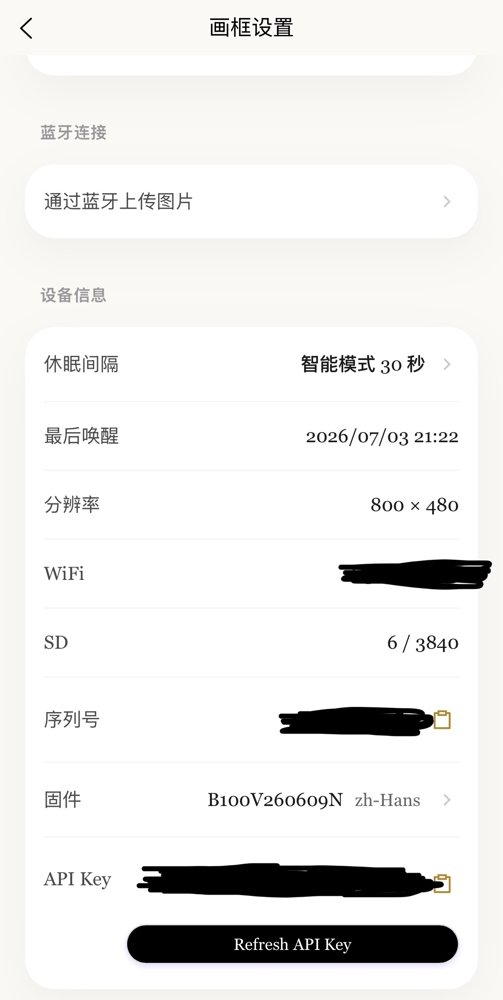

# Kokonna Digital Frame for Home Assistant

语言 / Language: [简体中文](#简体中文) | [English](#english)

---

## 简体中文

这是一个为 **Kokonna Digital Frame (数码相框)** 深度定制的 Home Assistant 自定义集成。它可以让你在 HA 中轻松实现相框的自动化控制、状态监控以及图片推送联动。

### 🚀 快捷添加 (Quick Setup)

如果你已经将集成文件放入对应的目录，可以直接点击下方的按钮，在你的 Home Assistant 中一键唤醒并添加配置：

---

### ✨ 主要功能

* 🖼️ **图片控制与推送**：提供 `image` 实体，支持直接向相框推送画面并控制刷新策略。
* ⚙️ **状态监控与设置**：动态生成 `sensor` 和 `select` 实体，用于实时监控相框硬件状态（如：分辨率、SD卡容量、固件版本等）及调整运行参数。
* 🎨 **完美本地化**：完美适配 Home Assistant 的本地品牌图标（Brand Icons）与暗色模式，支持多语言本地化。

### 📦 安装方法

目前本集成支持**手动安装**：

1. 下载本仓库的最新代码压缩包并解压。
2. 将 `custom_components/kokonna` 文件夹完整复制到你 Home Assistant 配置目录下的 `custom_components/` 文件夹中。
3. **重启** Home Assistant。

### ⚙️ 配置与 API Key 获取

本集成采用标准 **UI 配置流 (Config Flow)**。在配置过程中，你需要提供设备的 **API Key**。

#### 🔑 如何获取 API Key：
1. 打开数码相框配套的手机 App，进入 **「画框设置」** 页面。
2. 拉到页面最底部，即可找到 **API Key**，点击右侧的复制图标。
3. 复制后，在 Home Assistant 的引导界面中填入即可。

#### 🗺️ 配置步骤：
1. 重启 HA 后，点击上方的 [🎯 一键添加集成](https://my.home-assistant.io/app/config_flow_start?domain=kokonna) 按钮。
2. 或者前往 HA 的 **设置 -> 设备与服务 -> 添加集成**，搜索并选择 **Kokonna Digital Frame**。
3. 根据界面提示输入设备的 IP 地址或认证信息（API Key），点击提交即可自动完成设备发现。

### 🛠️ 支持的实体类型

成功添加设备后，集成将自动生成以下实体：
* `image.kokonna_digital_frame` - 用于显示、刷新和推送当前相框图像。
* `sensor.*` - 监控相框的在线状态、系统状态、SD卡容量等信息。
* `select.*` - 提供播放策略、配置项切换的选择菜单。

---

## English

This is a custom Home Assistant integration tailored for the **Kokonna Digital Frame**. It allows you to seamlessly integrate, automate, and monitor your digital frame directly within Home Assistant.

### 🚀 Quick Setup

If you have already placed the integration files into the correct directory, you can click the button below to instantly launch the setup process in your Home Assistant instance:

---

### ✨ Features

* 🖼️ **Image Control & Push**: Fully supports the `image` platform to display, refresh, and push new graphics to your frame dynamically.
* ⚙️ **State Monitoring**: Automatically exposes `sensor` and `select` entities to track device metrics (e.g., resolution, SD card capacity, firmware version) and switch playback modes.
* 🎨 **Native Brand Assets**: Fully optimized with native brand icons, light/dark mode support, and multi-language translations.

### 📦 Installation

This integration can be installed **manually**:

1. Download the latest release of this repository.
2. Copy the `custom_components/kokonna` directory into your Home Assistant's `custom_components/` directory.
3. **Restart** Home Assistant.

### ⚙️ Configuration & API Key Location

This integration supports standard **Config Flow (UI Configuration)**. You will need the device's **API Key** during setup.

#### 🔑 How to get the API Key:
1. Open the companion mobile app for your digital frame and navigate to **"Frame Settings" (画框设置)**.
2. Scroll to the bottom of the page to find the **API Key**, then click the copy icon.
3. Paste it into the Home Assistant configuration prompt.

#### 🗺️ Setup Steps:
1. After restarting HA, click the [🎯 Quick Setup](https://my.home-assistant.io/app/config_flow_start?domain=kokonna) button above.
2. Alternatively, go to **Settings -> Devices & Services -> Add Integration**, search for **Kokonna Digital Frame**.
3. Enter your device's IP address and API Key as prompted to complete the setup.

### 🛠️ Supported Entities

Once configured, the integration will expose the following entities:
* `image.kokonna_digital_frame` - For displaying, updating, and pushing images to the frame.
* `sensor.*` - For tracking connectivity, hardware capacity, or state metrics.
* `select.*` - For managing playback profiles and options.

---

## 📄 License & Contribution

If you encounter any bugs or have feature requests, feel free to open an **Issue** or submit a **Pull Request**!